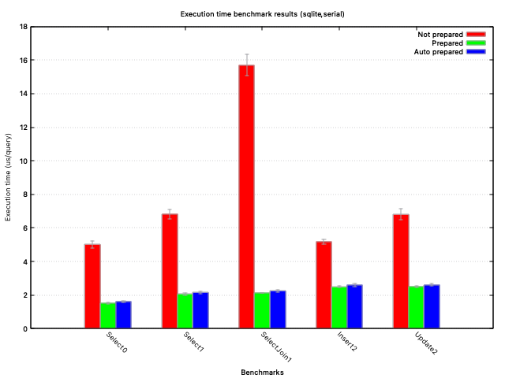

# autoprepare

Automatically prepare frequently-executed `database/sql` statements [](https://pkg.go.dev/github.com/CAFxX/autoprepare)

`autoprepare` is a small library that transparently monitors the most frequent `database/sql` queries that
your application executes and then automatically creates and uses the corresponding prepared statements.

## Usage

Instead of doing (error handling omitted for brevity):

```golang
db, _ := sql.Open("mysql", "/mydb")
res, _ := db.QueryContext(context.Background(), "SELECT * FROM mytable WHERE id = ?", 1)
// ... many more queries ...
```

you can do:

```golang
db, _ := sql.Open("mysql", "/mydb")
dbsc, _ := autoprepare.New(db) // add autoprepare
res, _ := dbsc.QueryContext(context.Background(), "SELECT * FROM mytable WHERE id = ?", 1)
// ... many more queries ...
```

and `autoprepare` will transparently start using prepared statements for the most common queries.

## Performance

**tl;dr Depending on your workload and setup you can expect from no improvements to extremely improved throughput ¯\\\_(ツ)\_/¯**

The effect of using prepared statements varies wildly with your database, network latencies, type of queries and workloads. The only way to know for sure is to benchmark your workloads.

Depending on the configuration (see below) and your workload, it may take some time for all important queries to be executed with prepared statements. When benchmarking make sure the prepared statement cache is fully warmed up. By default it takes N*5000 SQL queries for autoprepare to prepare the statements for the N most frequently executed queries (by default N is limited to 16): so e.g. if your application performs 3 really hot SQL queries, it's going to take at least 15000 queries before statements are created for those 3 queries.

A small benchmark is included in the test harness. You can run it with:

```shell
go test -run=NONE -bench=.
```

This will run it against an in-memory sqlite database. To run it instead against a mysql database
(replace `$MYSQL_DSN` with the DSN for your MySQL database):

```shell
go test -run=NONE -bench=. -benchdriver=mysql -mysql="$MYSQL_DSN" -benchparallel=false
```

Running the sqlite benchmark on my laptop yields something like this:



"Not prepared" means sending queries without preparing them, "Prepared" means sending the queries after
manually calling `Prepare()` on them and "Auto prepared" is letting `autoprepare` transparently handle
preparing the statements.

Currently the only drivers included in benchmark_test.go are sqlite and mysql. You can add additional
drivers if you want to benchmark other databases.

## Tips and notes

`autoprepare` is deliberately pretty conservative, as it will only prepare the most frequently executed 
statements, and it will only prepare a limited number of them (by default 16, see `WithMaxPreparedStmt`).
Statement preparation occurs in the background, not when queries are executed, to limit latency spikes
and to simplify the code. Statement preparation is triggered after a sizable amount of queries have been
sent (currently 5000), and will result in a single statement (the most common in the last 5000 queries)
being prepared. The frequency of executions is estimated using an exponential moving average.
If a prepared statement stops being frequently executed it will be closed so that other statements can be
prepared instead.

To limit the amount of memory used, both by the library and on the database, only statements shorter
than a certain length (by default 4KB, see `WithMaxQueryLen`) are eligibile for preparation.

It is recommended to not raise `WithMaxPreparedStmt` unnecessarily and to always use `sql.(*DB).SetMaxConn`
to set a limit to how many connections the `database/sql` pool will open to the database, as potentially
every prepared statement will need to be created on every connection, and some databases have internal
limits to how many prepared statements can exist at the same time: in this case the recommendation is to
monitor the number of prepared statements and memory usage on the database server.
Using `WithMaxPreparedStmt(0)` effectively disables all functionality provided by `autoprepare`.

It is important to understand that `autoprepare` uses the SQL query string to lookup prepared statements;
this means that it is critical, to allow `autoprepare` to be effective, to use placeholders in queries
(e.g. `SELECT name FROM t WHERE id = ?`). It is possible to not use placeholders, but in this case every
combination of arguments (e.g. `SELECT name FROM t WHERE id = 29` and `SELECT name FROM t WHERE id = 81`)
will be considered a different query for the purpose of measuring the most frequently-executed queries.
It is also important to note that the lookup is done on the SQL query string as-is (including whitespace),
so e.g.

```sql
SELECT * FROM table
```

and

```sql
SELECT *
FROM table
```

are considered separate queries by `autoprepare`, even though they are equivalent for the database.

Also note that using multiple statements in the same query (e.g. `SELECT 1; SELECT 2`) may not be supported
by the underlying driver.

`autoprepare` has been tested with the `sqlite3` and `mysql` drivers, but should reasonably work with
every conformant `database/sql` driver.
